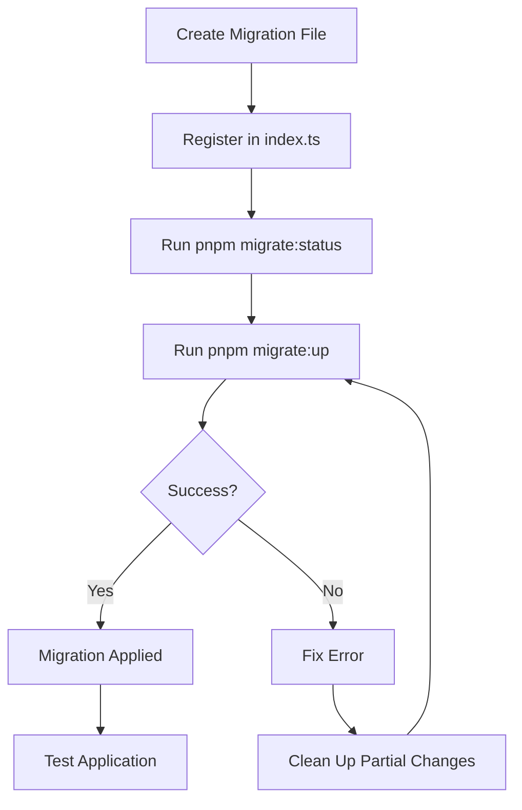

# Appwrite Migration System

## Overview

This migration system provides a structured way to manage your Appwrite database schema programmatically. It's similar to traditional database migration systems (like Drizzle, Prisma, or Laravel migrations) but specifically designed for Appwrite's collections, attributes, and indexes.

## Architecture

The migration system consists of:

1. **Migration Files** - Individual TypeScript files that define schema changes
2. **Migration Runner** - Core engine that executes migrations
3. **Migration Tracker** - Special collection that tracks applied migrations
4. **CLI Tool** - Command-line interface for managing migrations

## Directory Structure

```
apps/api/src/database/migrations/
├── migration.interface.ts              # TypeScript interfaces
├── migration-runner.ts                 # Core migration engine
├── cli.ts                              # CLI tool
├── index.ts                            # Migration registry
├── 20250123_000001_create_migrations_table.ts
├── 20250123_000002_create_users_table.ts
├── 20250123_000003_create_user_profiles_table.ts
├── 20250123_000004_create_user_preferences_table.ts
└── 20250123_000005_create_user_settings_table.ts
```

## Usage

### Prerequisites

Ensure your `.env` file contains:

```env
APPWRITE_ENDPOINT=https://cloud.appwrite.io/v1
APPWRITE_PROJECT_ID=your-project-id
APPWRITE_API_KEY=your-api-key
APPWRITE_DATABASE_ID=your-database-id
```

### Running Migrations

```bash
# Run all pending migrations
pnpm migrate:up

# Check migration status
pnpm migrate:status

# Rollback the last migration
pnpm migrate:down

# Reset database (rollback ALL migrations - DANGER!)
CONFIRM_RESET=yes pnpm migrate:reset
```

### Migration Status Output

```
📊 Migration Status

Applied Migrations: 5
Total Migrations: 5
Pending Migrations: 0

✅ Applied:
   - 20250123_000001_create_migrations_table: Create migrations tracking collection
   - 20250123_000002_create_users_table: Create users collection
   - 20250123_000003_create_user_profiles_table: Create user profiles collection
   - 20250123_000004_create_user_preferences_table: Create user preferences collection
   - 20250123_000005_create_user_settings_table: Create user settings collection
```

## Creating New Migrations

### Step 1: Create Migration File

Create a new file in `apps/api/src/database/migrations/`:

```typescript
// 20250123_000006_create_transactions_table.ts
import { IndexType } from 'node-appwrite';
import { Migration, MigrationContext } from './migration.interface';

export const migration: Migration = {
  id: '20250123_000006_create_transactions_table',
  description: 'Create transactions collection',

  async up(context: MigrationContext): Promise<void> {
    const { databases, databaseId } = context;

    // Create collection
    await databases.createCollection({
      databaseId,
      collectionId: 'transactions',
      name: 'Transactions',
      permissions: ['read("any")', 'write("any")'],
      documentSecurity: true,
      enabled: true,
    });

    // Add attributes
    await databases.createStringAttribute({
      databaseId,
      collectionId: 'transactions',
      key: 'user_id',
      size: 255,
      required: true,
    });

    await databases.createFloatAttribute({
      databaseId,
      collectionId: 'transactions',
      key: 'amount',
      required: true,
    });

    await databases.createDatetimeAttribute({
      databaseId,
      collectionId: 'transactions',
      key: 'created_at',
      required: true,
    });

    // Create indexes
    await databases.createIndex({
      databaseId,
      collectionId: 'transactions',
      key: 'idx_user_id',
      type: IndexType.Key,
      attributes: ['user_id'],
    });

    console.log('✅ Created transactions collection');
  },

  async down(context: MigrationContext): Promise<void> {
    const { databases, databaseId } = context;

    await databases.deleteCollection({
      databaseId,
      collectionId: 'transactions',
    });

    console.log('✅ Deleted transactions collection');
  },
};
```

### Step 2: Register Migration

Add your migration to `apps/api/src/database/migrations/index.ts`:

```typescript
import { migration as createTransactionsTable } from './20250123_000006_create_transactions_table';

export const migrations: Migration[] = [
  createMigrationsTable,
  createUsersTable,
  createUserProfilesTable,
  createUserPreferencesTable,
  createUserSettingsTable,
  createTransactionsTable, // Add here
];
```

### Step 3: Run Migration

```bash
pnpm migrate:up
```

## Migration Naming Convention

Migrations follow this format:

```
YYYYMMDD_NNNNNN_description.ts
```

- `YYYYMMDD` - Date in YYYYMMDD format
- `NNNNNN` - Sequence number (000001, 000002, etc.)
- `description` - Snake_case description

Examples:
- `20250123_000001_create_migrations_table.ts`
- `20250123_000002_create_users_table.ts`
- `20250124_000003_add_avatar_to_profiles.ts`

## Attribute Types

### String Attribute

```typescript
await databases.createStringAttribute({
  databaseId,
  collectionId: 'collection_id',
  key: 'field_name',
  size: 255,
  required: true,
  xdefault: 'default_value', // Optional, only for required fields
});
```

### Email Attribute

```typescript
await databases.createEmailAttribute({
  databaseId,
  collectionId: 'collection_id',
  key: 'email',
  required: true,
});
```

### Enum Attribute

```typescript
await databases.createEnumAttribute({
  databaseId,
  collectionId: 'collection_id',
  key: 'status',
  elements: ['active', 'inactive', 'pending'],
  required: true,
  xdefault: 'pending',
});
```

### Boolean Attribute

```typescript
await databases.createBooleanAttribute({
  databaseId,
  collectionId: 'collection_id',
  key: 'is_active',
  required: true,
  xdefault: false,
});
```

### Integer Attribute

```typescript
await databases.createIntegerAttribute({
  databaseId,
  collectionId: 'collection_id',
  key: 'count',
  required: true,
  min: 0,
  max: 1000,
});
```

### Float Attribute

```typescript
await databases.createFloatAttribute({
  databaseId,
  collectionId: 'collection_id',
  key: 'price',
  required: true,
  min: 0,
});
```

### DateTime Attribute

```typescript
await databases.createDatetimeAttribute({
  databaseId,
  collectionId: 'collection_id',
  key: 'created_at',
  required: true,
});
```

### URL Attribute

```typescript
await databases.createUrlAttribute({
  databaseId,
  collectionId: 'collection_id',
  key: 'website',
  required: false,
});
```

## Index Types

```typescript
import { IndexType } from 'node-appwrite';

// Unique index - ensures no duplicate values
await databases.createIndex({
  databaseId,
  collectionId: 'collection_id',
  key: 'idx_unique_field',
  type: IndexType.Unique,
  attributes: ['field_name'],
});

// Key index - for faster queries
await databases.createIndex({
  databaseId,
  collectionId: 'collection_id',
  key: 'idx_search_field',
  type: IndexType.Key,
  attributes: ['field_name'],
});

// Fulltext index - for text search
await databases.createIndex({
  databaseId,
  collectionId: 'collection_id',
  key: 'idx_fulltext_search',
  type: IndexType.Fulltext,
  attributes: ['text_field'],
});
```

## Best Practices

### 1. Never Modify Existing Migrations

Once a migration is applied, **never change it**. Instead, create a new migration to make changes.

❌ **Bad:**
```typescript
// Modifying existing migration
export const migration: Migration = {
  id: '20250123_000002_create_users_table',
  // Changed: Added new field here
};
```

✅ **Good:**
```typescript
// Create new migration
export const migration: Migration = {
  id: '20250124_000006_add_phone_to_users',
  description: 'Add phone field to users',
  // ...
};
```

### 2. Always Provide Down Migration

Every migration should have a corresponding `down()` method for rollback:

```typescript
async down(context: MigrationContext): Promise<void> {
  // Reverse everything done in up()
}
```

### 3. Test Migrations Locally First

```bash
# Test migration
pnpm migrate:up

# Verify it worked
pnpm migrate:status

# Test rollback
pnpm migrate:down

# Re-apply
pnpm migrate:up
```

### 4. Use Descriptive Migration Names

❌ Bad: `20250123_000001_update.ts`
✅ Good: `20250123_000001_add_email_verification_to_users.ts`

### 5. Atomic Migrations

Keep migrations focused on one logical change:

✅ Good:
- `20250123_000001_create_users_table.ts`
- `20250123_000002_create_transactions_table.ts`
- `20250123_000003_add_user_id_to_transactions.ts`

❌ Bad:
- `20250123_000001_create_all_tables_and_add_indexes.ts`

## Troubleshooting

### Migration Stuck or Failed

If a migration fails partway through:

1. Check the error message
2. Fix the issue in the migration file
3. Manually delete any partially created collections/attributes in Appwrite Console
4. Re-run the migration

### Reset Database

⚠️ **WARNING: This deletes ALL data!**

```bash
CONFIRM_RESET=yes pnpm migrate:reset
```

### Check Current State

```bash
# See which migrations are applied
pnpm migrate:status
```

## Advanced Examples

### Adding a Column to Existing Table

```typescript
export const migration: Migration = {
  id: '20250124_000006_add_verified_at_to_users',
  description: 'Add verified_at timestamp to users',

  async up(context: MigrationContext): Promise<void> {
    await context.databases.createDatetimeAttribute({
      databaseId: context.databaseId,
      collectionId: 'users',
      key: 'verified_at',
      required: false,
    });
  },

  async down(context: MigrationContext): Promise<void> {
    await context.databases.deleteAttribute({
      databaseId: context.databaseId,
      collectionId: 'users',
      key: 'verified_at',
    });
  },
};
```

### Creating Relationship Between Collections

```typescript
export const migration: Migration = {
  id: '20250124_000007_add_user_relationship',
  description: 'Add relationship between users and profiles',

  async up(context: MigrationContext): Promise<void> {
    await context.databases.createRelationshipAttribute({
      databaseId: context.databaseId,
      collectionId: 'user_profiles',
      relatedCollectionId: 'users',
      type: 'oneToOne',
      key: 'user',
    });
  },

  async down(context: MigrationContext): Promise<void> {
    await context.databases.deleteAttribute({
      databaseId: context.databaseId,
      collectionId: 'user_profiles',
      key: 'user',
    });
  },
};
```

## Migration Workflow



## Safety Features

1. **Idempotency** - Migrations track which have been applied
2. **Ordered Execution** - Migrations always run in order
3. **Error Handling** - Failed migrations stop the process
4. **Rollback Support** - Every migration can be reversed
5. **Confirmation Required** - Reset requires explicit confirmation

## Integration with Application

Your application code automatically uses the collections created by migrations. No additional configuration needed - just ensure migrations are run before deploying:

```bash
# In deployment pipeline
pnpm migrate:up
pnpm build
pnpm start:prod
```

## Conclusion

This migration system provides a robust, version-controlled way to manage your Appwrite database schema. It ensures consistency across environments (development, staging, production) and makes schema changes traceable and reversible.

For questions or issues, refer to:
- Appwrite Databases Documentation: https://appwrite.io/docs/products/databases
- Appwrite Server SDK: https://appwrite.io/docs/references/cloud/server-nodejs/databases
